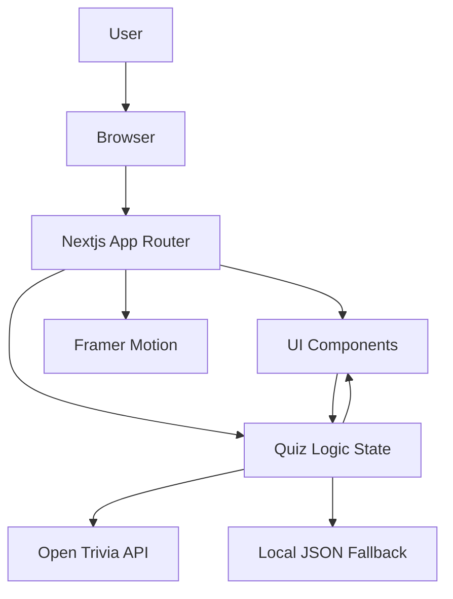

# Quizz - The Smartest Quiz Companion

[](https://quezz.vercel.app)


**Quezz** is a sleek, interactive quiz app built with the latest web technologies—**Next.js 14+ App Router**, **TypeScript**, **Tailwind CSS**, **shadcn/ui**, and **Framer Motion**—powered by the Open Trivia DB API.

Test your knowledge, challenge your friends, and enjoy a buttery-smooth quiz experience—whether you're online or offline.

---

## ✨ Features

- 🚀 **Blazing-fast & Modern**: Built with Next.js 14+ App Router & TypeScript  
- 🎨 **Beautiful UI**: Tailwind CSS + shadcn/ui components with polished styling  
- 🎞️ **Framer Motion Animations**: Smooth transitions & engaging micro-interactions  
- 🧩 **Dynamic Quizzes**: Pulls questions in real-time from [Open Trivia DB](https://opentdb.com/)  
- ⚙️ **Fallback/Offline Mode**: Works even when the API fails (offline-first experience)  
- ♿ **Accessible by Design**: Keyboard navigation, focus rings, screen-reader friendly  
- 🧠 **Categories, Difficulty, Types**: Customize your quiz just the way you like it  
- 📊 **Scoreboard**: See how you did after each round  

---

## 📸 Preview

> _Add screenshots or a GIF here to showcase UI (e.g., `/public/screenshots/homepage.png`)_

---

## 🛠️ Tech Stack

| Tech              | Role                      |
|-------------------|---------------------------|
| **Next.js 14+**   | App Router, SSR/SSG/ISR   |
| **TypeScript**    | Type safety & dev UX      |
| **Tailwind CSS**  | Utility-first styling     |
| **shadcn/ui**     | Accessible UI components  |
| **Framer Motion** | Animations & transitions  |
| **Open Trivia API** | Live question fetching  |

---

## 🧱 Architecture (PlantUML Diagram)

> System architecture of Quezz — including API integration, fallback handling, and component structure.



> _Generated with [mermaid](https://plantuml.com/), 

---

## 🚧 Installation & Development

```bash
git clone https://github.com/Arknight007/quezz.git
cd quezz
pnpm install  # or npm / yarn
pnpm dev      # run locally
```

Open `http://localhost:3000` to start using the app.

---

## 🧪 Want to Test It?

Try the [Live Demo](https://quezz.vercel.app) or run locally using the steps above.

Customize quiz settings and hit "Start Quiz" to experience the magic.

---

## 📁 Folder Structure

```
quezz/
├── app/               # Next.js App Router pages/layouts
├── components/        # Reusable UI components (Buttons, Card, Timer, etc.)
├── lib/               # Utility functions (e.g., shuffle, fetch logic)
├── public/            # Static assets (images, fallback.json, diagrams)
├── styles/            # Global styles (tailwind.config, etc.)
├── types/             # TypeScript interfaces/types
└── ...
```

---

## 🌐 API Reference

All questions are fetched from [Open Trivia DB](https://opentdb.com/api_config.php). You can filter by:

- **Category** (e.g., Science, History, Tech)  
- **Difficulty** (`easy`, `medium`, `hard`)  
- **Type** (`multiple`, `boolean`)  

---

## 📡 Offline Mode Logic

If the API is unavailable, a fallback set of questions is used from a local JSON file (`/lib/data/fallback.json`) ensuring the quiz experience remains uninterrupted.

---

## 🤝 Contributing

Pull requests are welcome! If you'd like to:

- Add more question sources (e.g., custom APIs)  
- Improve animations or accessibility  
- Add new game modes (timed quiz, multiplayer, etc.)  

...just fork the repo and go wild! 😄

---

## 📜 License

This project is licensed under the [MIT License](LICENSE).

---

> _“Knowledge is power. But a good quiz makes it fun!”_
